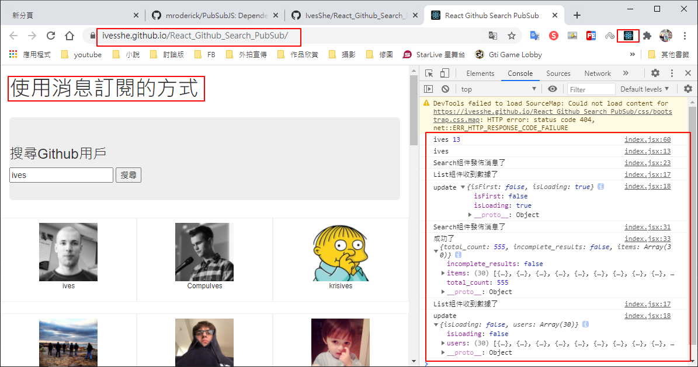

# React Github Search PubSub 使用消息訂閱、補充Fetch、async、await

優化此專案

https://github.com/IvesShe/React_Github_Search

使用訂閱的方式，完成兄弟組件間消息的傳遞

# Github展示

https://ivesshe.github.io/React_Github_Search_PubSub/



# 訂閱消息

1. 消息名
2. 發佈消息

# 消息訂閱 - 發佈機制

下載安裝PubSubJS

```bash
npm i pubsub-js --save
```


使用方式

```js
// 引用
import PubSub from 'pubsub-js'  

// 訂閱
PubSub.subsribe('delete',function(data){}); 

// 發佈消息
PubSub.publish('delete',data);
```

官網參考

https://github.com/mroderick/PubSubJS

# 執行畫面


# Github上傳

可以參考之前的文檔

https://github.com/IvesShe/React_TodoList

# 源代碼

## App.jsx

```jsx
import React, { Component } from 'react'
import List from './componets/List';
import Search from './componets/Search';

export default class App extends Component {
  render() {
    return (
      <div className="App">
        <div className="container">
          <h1>使用消息訂閱的方式</h1><br/>
          <Search />
          <List />
        </div>
      </div>
    );
  }
}
```

## Search/index.jsx

```jsx
import React, { Component } from 'react'
import PubSub from 'pubsub-js'
import axios from 'axios'
export default class Search extends Component {

    search = ()=>{
        
        // 獲取用戶的輸入
        //console.log(this.keyWordElement.value);

        // 連續解構賦值+重命名
        const {keyWordElement:{value:keyWord}} = this;
        console.log(keyWord);

        // 不能為空
        if(keyWord.trim() === ''){
            alert('輸入不能為空');
            return;
        }

        // 發送請求前通知List更新狀態
        //this.props.updateAppState({isFirst:false,isLoading:true});
        console.log('Search組件發佈消息了');
        PubSub.publish('update',{isFirst:false,isLoading:true});
        
        // 發送網絡請求
        axios.get(`https://api.github.com/search/users?q=${keyWord}`).then(
            response => {
                // 請求成功後通知List更新狀態
                //this.props.updateAppState({isLoading:false,users:response.data.items});
                console.log('Search組件發佈消息了');
                PubSub.publish('update',{isLoading:false,users:response.data.items});
                console.log('成功了',response.data);
            },
            error => {
                // 請求失敗後通知App更新狀態
                //this.props.updateAppState({isLoading:false,err:error})
                console.log('Search組件發佈消息了');
                PubSub.publish('update',{isLoading:false,err:error});
                console.log('失敗了',error);
            }
        )
    }

    // 鍵盤事件的回調
    // 可以點擊搜尋按鍵 或 直接按下Enter
    handleKeyUp = (event)=>{
        const {keyCode,target} = event;

        // 判斷是否為Enter按鍵
        if(keyCode !== 13) return;

        // 不能為空
        if(target.value.trim() === ''){
            alert('輸入不能為空');
            return;
        }

        // 打印所按的值、按鍵的值
        console.log(target.value, keyCode);

        this.search();
    }

    render() {
        return (
            <div>
                <section className="jumbotron">
                    <h3 className="jumbotron-heading">搜尋Github用戶</h3>
                    <div>
                        <input onKeyUp={this.handleKeyUp} ref={c => this.keyWordElement = c} type="text" placeholder="輸入關鍵詞點擊搜尋" />&nbsp;
                        <button onClick={this.search}>搜尋</button>
                    </div>
                </section>
            </div>
        )
    }
}

```

## List/index.jsx

```jsx
import React, { Component } from 'react'
import PubSub from 'pubsub-js'
import './index.css'

export default class List extends Component {

    state = {
        users: [],         // 初始化狀態，users初始化為數組
        isFirst: true,     // 是否為第一次打開頁面
        isLoading: false,  // 標識是否處於加載中
        err: '',           // 存儲請求相關的錯誤信息
    };

    // 組件掛載時
    componentDidMount(){
        PubSub.subscribe('update',(msg,stateObj)=>{
            console.log('List組件收到數據了');
            console.log(msg,stateObj);
            this.setState(stateObj);
        })
    }

    render() {
        const { users, isFirst, isLoading, err } = this.state;

        return (
            <div className="row">
                {
                    isFirst ? <h2>歡迎使用，請輸入關鍵字，隨後點擊搜尋</h2> :
                        isLoading ? <h2>努力加載中......</h2> :
                            err ? <h2 style={{ color: 'red' }}>{err}</h2> :
                                users.map((userObj) => {
                                    return (
                                        <div key={userObj.id} className="card">
                                            <a rel="noreferrer" href={userObj.html_url} target="_blank">
                                                
                                            </a>
                                            <p className="card-text">{userObj.login}</p>
                                        </div>
                                    )
                                }
                                )
                }
            </div>
        )
    }
}

```

## List/index.css

```css
.album {
    min-height: 50rem; /* Can be removed; just added for demo purposes */
    padding-top: 3rem;
    padding-bottom: 3rem;
    background-color: #f7f7f7;
  }
  
  .card {
    float: left;
    width: 33.333%;
    padding: .75rem;
    margin-bottom: 2rem;
    border: 1px solid #efefef;
    text-align: center;
  }
  
  .card > img {
    margin-bottom: .75rem;
    border-radius: 100px;
  }
  
  .card-text {
    font-size: 85%;
  }
  
```

# Fetch補充

## Fetch特點

1. fetch:原生函數，不再使用XmlHttpRequest對象提交ajax請求
2. 老版本瀏覽器可能不支持

## 原使用的axiox的XHR請求

```js
// 發送網絡請求
axios.get(`https://api.github.com/search/users?q=${keyWord}`).then(
    response => {
        // 請求成功後通知List更新狀態
        //this.props.updateAppState({isLoading:false,users:response.data.items});
        console.log('Search組件發佈消息了');
        PubSub.publish('update',{isLoading:false,users:response.data.items});
        console.log('成功了',response.data);
    },
    error => {
        // 請求失敗後通知App更新狀態
        //this.props.updateAppState({isLoading:false,err:error})
        console.log('Search組件發佈消息了');
        PubSub.publish('update',{isLoading:false,err:error});
        console.log('失敗了',error);
    }
)
```

## 可以改用Fetch請求

error的部分，這邊演示了兩種方式，一種是各別判斷error(註解的區塊)，另一種是統一處理error

```js
// 發送網路請求--使用fetch發送
fetch(`https://api.github.com/search/users?q=${keyWord}`).then(
    // 會先連接服務器
    response => {
        console.log('連接服務器成功了');
        // 回傳獲取到的數據
        return response.json();
    },
    // error => {
    //     console.log('連接服務器失敗了', error);
    //     console.log('Search組件發佈消息了');
    //     PubSub.publish('update', { isLoading: false, err: error });
    //     console.log('失敗了', error);
    //     // 回傳初始化狀態的Promise實例，使程序到此終止不再往下跑後續的then
    //     // 回傳非Promise的話會再往下跑then
    //     return new Promise(() => { })
    // }
).then(
    // 這邊會獲取數據，接到空的Promise函數代表失敗了
    response => {
        console.log('獲取數據成功了', response);
        console.log('Search組件發佈消息了');
        const data = response;
        PubSub.publish('update', { isLoading: false, users: data.items });
        console.log('成功了', data);
    },
    // error => {
    //     console.log('獲取數據失敗了', error);
    //     console.log('Search組件發佈消息了');
    //     PubSub.publish('update', { isLoading: false, err: error });
    //     console.log('失敗了', error);
    // }
).catch(
    // 統一處理error
    (error)=>{
        console.log('Search組件發佈消息了');
        PubSub.publish('update', { isLoading: false, err: error });
        console.log('失敗了', error);
    }
)
```

## 上面的代碼，可以使用await改寫

```js
// 發送網路請求--使用fetch發送(優化)
try {
    console.log('使用async、await、fetch獲取數據了');
    const response = await fetch(`https://api.github.com/search/users?q=${keyWord}`)
    const data = await response.json()
    console.log('Search組件發佈消息了');
    PubSub.publish('update', { isLoading: false, users: data.items });
    console.log('成功了', data);
} catch (error) {
    console.log('Search組件發佈消息了');
    PubSub.publish('update', { isLoading: false, err: error });
    console.log('失敗了', error);
}
```

使用await需要搭配async，所以這邊要加關鍵字

```js
search = async()=>{
```

## Fetch參考文檔 

https://github.github.io/fetch/

https://segmentfault.com/a/1190000003810652

